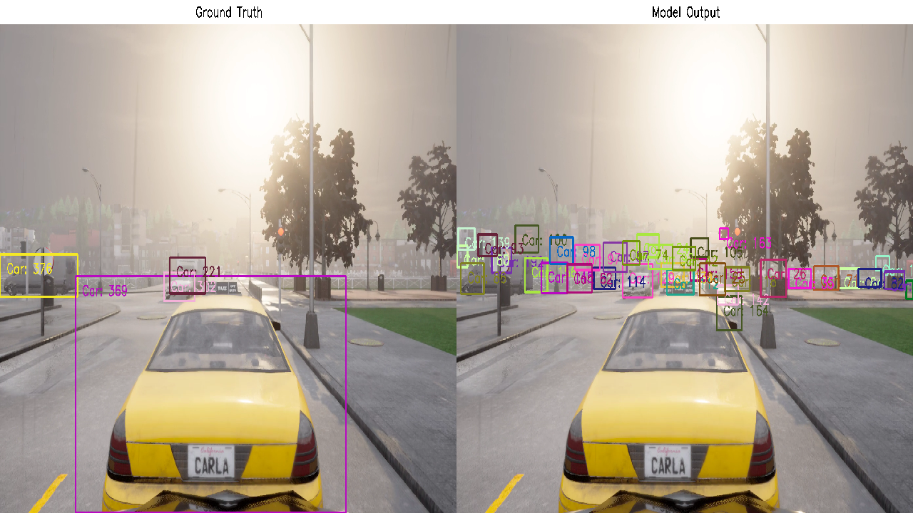

# Adversarial Tracking

> [!NOTE]
> The example code only draws bounding boxes for cars.

To see all detected objects, you need to change:

```
# Only draw 2: car, 5: bus, 7: truck
boxes = np.array([box for box, label in zip(boxes, labels) if label in [2, 5, 7]])
probs = np.array([prob for prob, label in zip(probs, labels) if label in [2, 5, 7]])
labels = np.array([2 for label in labels if label in [2, 5, 7]])
```

To:

```
boxes = np.array([box for box, label in zip(boxes, labels)])
probs = np.array([prob for prob, label in zip(probs, labels)])
labels = np.array([COCO_CLASS_NAMES[label] for label in labels])
```




# Quick Start

Using `uv` to create a python virtual environment.

```
uv sync
```

Download and extract the dataset:

```
data
├─gt
│  ├─carla
│  └─kitti
├─trackers
│  ├─carla
│  └─kitti
└─video
    ├─carla
    └─kitti
```

You can find the dataset here (KITTI and CARLA): https://github.com/wuhanstudio/adversarial-tracking/releases

## 2D Object Tracking

    VIDEO=0 # 0 - 20

    python 2d-tracking-yolov3-sort.py --video ${VIDEO} --dataset carla
    python 2d-tracking-yolov3-deep-sort.py --video ${VIDEO} --dataset carla
    python 2d-tracking-yolov3-strong-sort.py --video ${VIDEO} --dataset carla
    python 2d-tracking-yolov3-oc-sort.py --video ${VIDEO} --dataset carla

    python 2d-tracking-yolov4-sort.py --video ${VIDEO} --dataset carla
    python 2d-tracking-yolov4-deep-sort.py --video ${VIDEO} --dataset carla
    python 2d-tracking-yolov4-strong-sort.py --video ${VIDEO} --dataset carla
    python 2d-tracking-yolov4-oc-sort.py --video ${VIDEO} --dataset carla

    python 2d-tracking-pcb-attack-yolov3-sort.py --video ${VIDEO} --dataset carla
    python 2d-tracking-pcb-attack-yolov3-oc-sort.py --video ${VIDEO} --dataset carla

    python 2d-tracking-pcb-attack-yolov4-sort.py --video ${VIDEO} --dataset carla
    python 2d-tracking-pcb-attack-yolov4-oc-sort.py --video ${VIDEO} --dataset carla

## 2D Adversarial Tracking

    VIDEO=0 # 0 - 20

    python 2d-tracking-yolov3-sort.py --video ${VIDEO} --dataset carla
    python 2d-tracking-yolov3-deep-sort.py --video ${VIDEO} --dataset carla
    python 2d-tracking-yolov3-strong-sort.py --video ${VIDEO} --dataset carla
    python 2d-tracking-yolov3-oc-sort.py --video ${VIDEO} --dataset carla

    python 2d-tracking-yolov4-sort.py --video ${VIDEO} --dataset carla
    python 2d-tracking-yolov4-deep-sort.py --video ${VIDEO} --dataset carla
    python 2d-tracking-yolov4-strong-sort.py --video ${VIDEO} --dataset carla
    python 2d-tracking-yolov4-oc-sort.py --video ${VIDEO} --dataset carla

    python 2d-tracking-pcb-attack-yolov3-sort.py --video ${VIDEO} --dataset carla
    python 2d-tracking-pcb-attack-yolov3-oc-sort.py --video ${VIDEO} --dataset carla

    python 2d-tracking-pcb-attack-yolov4-sort.py --video ${VIDEO} --dataset carla
    python 2d-tracking-pcb-attack-yolov4-oc-sort.py --video ${VIDEO} --dataset carla

## 2d Adversarial Tracking (UAP)

    VIDEO=0 # 0 - 20

    python 2d-tracking-yolov3-sort.py --video ${VIDEO} --dataset carla --noise noise/yolov3_noise_pcb_0003_99.npy
    python 2d-tracking-yolov3-deep-sort.py --video ${VIDEO} --dataset carla --noise noise/yolov3_noise_pcb_0003_99.npy
    python 2d-tracking-yolov3-strong-sort.py --video ${VIDEO} --dataset carla --noise noise/yolov3_noise_pcb_0003_99.npy
    python 2d-tracking-yolov3-oc-sort.py --video ${VIDEO} --dataset carla --noise noise/yolov3_noise_pcb_0003_99.npy

    python 2d-tracking-yolov4-sort.py --video ${VIDEO} --dataset carla --noise noise/yolov4_noise_pcb_0003_99.npy
    python 2d-tracking-yolov4-deep-sort.py --video ${VIDEO} --dataset carla --noise noise/yolov4_noise_pcb_0003_99.npy
    python 2d-tracking-yolov4-strong-sort.py --video ${VIDEO} --dataset carla --noise noise/yolov4_noise_pcb_0003_99.npy
    python 2d-tracking-yolov4-oc-sort.py --video ${VIDEO} --dataset carla --noise noise/yolov4_noise_pcb_0003_99.npy
